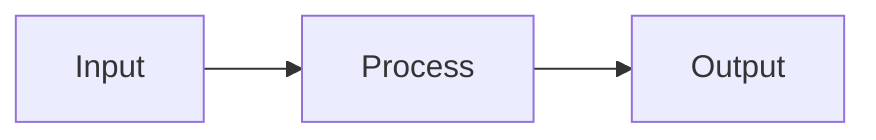
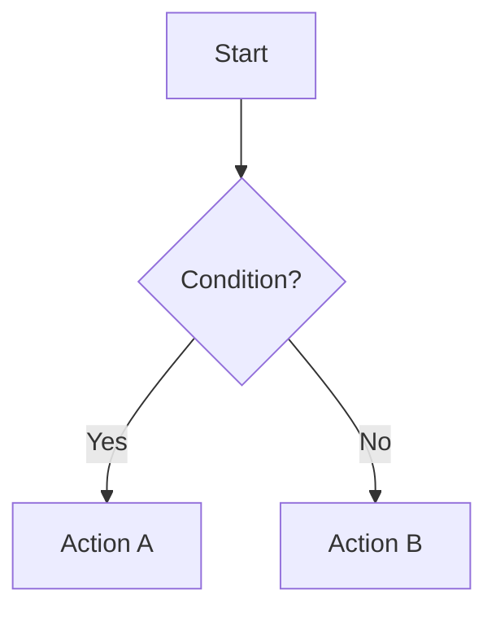
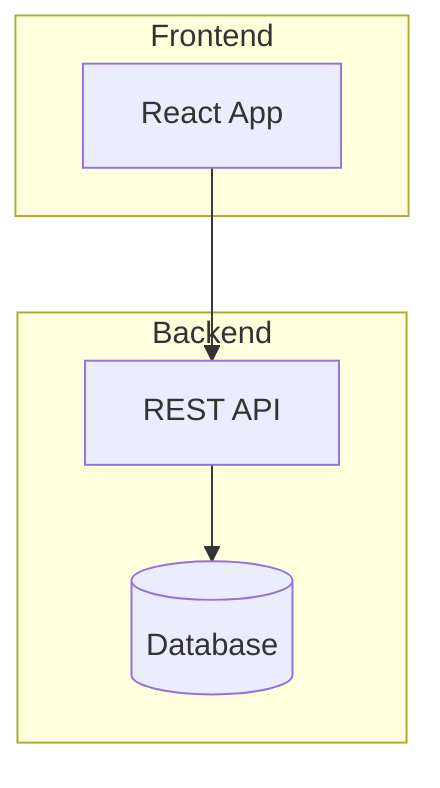
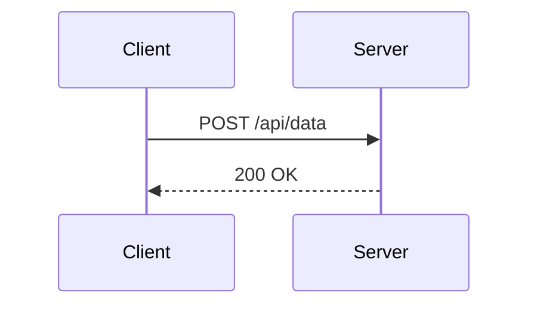

# Diagram Gen

Generate professional diagrams from natural language or structured descriptions.
Primary output is Mermaid syntax (auto-layout, GitHub/Obsidian native), with SVG
rendering via `beautiful-mermaid` for polished visuals.

## Agent Delegation

Delegate Mermaid code generation and SVG rendering to `designer` agent.

- **Agent**: `designer` (Sonnet, maxTurns=20)
- **Tools**: Read, Write, Edit, Bash, Glob
- **Delegate when**: generating Mermaid syntax, applying themes, rendering SVG files

## Output Formats

| Format | When to Use | How |
|--------|------------|-----|
| **Mermaid code block** | README, GitHub, Obsidian, quick preview | Wrap in ` ```mermaid ` fence |
| **SVG file** | Docs, presentations, high-quality visuals | `node scripts/render.mjs` |
| **ASCII art** | Terminal, plain text, logs | `node scripts/render.mjs --format ascii` |

Default to **Mermaid code block** unless the user requests a file or mentions SVG/PNG.

## Workflow

### Step 1 — Analyze Content

Identify the core structure:

**Sandbox acceleration**: When generating diagrams from a codebase, use `sandbox_execute` to batch-scan source files — extract function signatures, class hierarchies, import relationships, and module boundaries in one call. Returns a structured code map instead of loading full source files into context.

- **Sequential steps** → Flowchart
- **Interactions over time** → Sequence diagram
- **States and transitions** → State diagram
- **Object relationships** → Class diagram
- **Data models** → ER diagram
- **Hierarchy/brainstorm** → Mindmap
- **Timeline/schedule** → Gantt chart
- **Cloud/infra** → Architecture (flowchart with groups)

If ambiguous, default to **flowchart** (most versatile).

### Step 2 — Choose Layout

- **Vertical (TB)** — Default. Best for processes, hierarchies.
- **Horizontal (LR)** — Best for timelines, pipelines, wide content.
- **Mixed** — Use `direction` inside subgraphs for complex layouts.

### Step 3 — Generate Mermaid Code

Follow the **Critical Syntax Rules** below strictly. Apply semantic colors.
Keep diagrams under 30 nodes for readability; split into multiple diagrams if larger.

### Step 4 — Render (if requested)

```bash
RENDER="node ~/.claude/skills/diagram-gen/scripts/render.mjs"

# SVG with theme
$RENDER --input diagram.mmd --output diagram.svg --theme tokyo-night

# Transparent background (dark/light mode compatible)
$RENDER --input diagram.mmd --output diagram.svg --theme github-dark --transparent

# ASCII for terminal
$RENDER --input diagram.mmd --format ascii
```

### Step 5 — Validate

Run through the Quality Checklist before outputting.

## Critical Syntax Rules

**These 5 rules prevent the most common Mermaid parsing errors.**

### Rule 1: No "Number. Space" in Node Text

```
WRONG: [1. Perception]         → Parse error: Unsupported markdown: list
RIGHT: [1.Perception]          → Remove the space
RIGHT: [(1) Perception]        → Use parentheses
RIGHT: [Step 1: Perception]    → Use prefix
```

### Rule 2: Subgraph Names with Spaces

```
WRONG: subgraph Core Process
RIGHT: subgraph core["Core Process"]
```

### Rule 3: Reference by ID, Not Display Text

```
WRONG: Title --> Core Process
RIGHT: Title --> core
```

### Rule 4: Special Characters

```
Use quotes for spaces:  ["Text with spaces"]
Avoid raw quotes:       use 『』 instead
Avoid raw parens:       use 「」 instead
```

### Rule 5: Arrow Types

```
-->    solid arrow (default)
-.->   dashed arrow (optional, secondary)
==>    thick arrow (emphasis, critical path)
~~~    invisible link (layout control only)
```

For the complete syntax reference, see `references/mermaid-syntax.md`.

## Semantic Color Palette

Map colors to **meaning**, not decoration. Apply via `style` declarations.

| Role | Fill | Stroke | Use For |
|------|------|--------|---------|
| Input / Start | `#d3f9d8` | `#2f9e44` | Entry points, data sources |
| Process / Action | `#dae8fc` | `#6c8ebf` | Core processing steps |
| Decision | `#fff2cc` | `#d6b656` | Branching points, conditions |
| Output / Result | `#c5f6fa` | `#0c8599` | End results, deliverables |
| Warning / Error | `#ffe3e3` | `#c92a2a` | Failure paths, alerts |
| Storage / Data | `#fff4e6` | `#e67700` | Databases, caches, memory |
| Reasoning | `#e5dbff` | `#5f3dc4` | AI/ML, analysis, thinking |
| Neutral | `#f8f9fa` | `#868e96` | Secondary, background |

**60-30-10 Rule**: 60% neutral/process, 30% semantic highlights, 10% emphasis/warnings.

## Theme Reference (SVG Rendering)

| Theme | Style | Best For |
|-------|-------|----------|
| `tokyo-night` | Dark, modern | Developer docs |
| `github-dark` | Dark, familiar | GitHub pages |
| `github-light` | Light, clean | Print, light mode |
| `dracula` | Dark, vibrant | High contrast |
| `nord` | Dark, cool | Minimalist |
| `catppuccin-mocha` | Dark, warm | Cozy docs |
| `catppuccin-latte` | Light, warm | Friendly docs |
| `zinc-light` | Light, sharp | Presentations |
| `solarized-dark` | Dark, balanced | Terminal-adjacent |
| `solarized-light` | Light, balanced | Academic |

Full theme list: `node scripts/render.mjs --list-themes`

## Quick Patterns

### Pipeline / Workflow


### Decision Tree


### Grouped Architecture


### Sequence (API Flow)


See `references/diagram-patterns.md` for the full catalog.

## Quality Checklist

Before outputting any diagram, verify:

- No `number. space` patterns in node text
- All subgraphs use `id["Display Name"]` format
- All references use node/subgraph IDs
- Arrow syntax is correct (`-->`, `-.->`, `==>`)
- Colors follow semantic palette (not random)
- Layout direction explicitly set
- Under 30 nodes (split if larger)
- No emoji in diagram text — use labels or color coding
- Compatible with GitHub/Obsidian Mermaid renderers

## Sandbox Optimization

Step 1 (Analyze Content) benefits from sandbox execution:

- **Codebase diagrams**: Batch-scan source files to extract structure (classes, functions, imports, module boundaries) in one `sandbox_execute` call. Returns a structured code map (~300 tokens) instead of reading 10+ source files into context.
- **Data model diagrams**: Batch-read schema files (SQL, Prisma, TypeORM) and extract entity-relationship data.

Principle: **Code structure extraction → sandbox; diagram design + Mermaid generation → LLM.**

## Continuous Improvement

This skill evolves with each use. After every invocation:

1. **Reflect** — Identify what worked, what caused friction, and any unexpected issues
2. **Record** — Append a concise lesson to `lessons.md` in this skill's directory
3. **Refine** — When a pattern recurs (2+ times), update SKILL.md directly

### lessons.md Entry Format

```
### YYYY-MM-DD — Brief title
- **Friction**: What went wrong or was suboptimal
- **Fix**: How it was resolved
- **Rule**: Generalizable takeaway for future invocations
```

Accumulated lessons signal when to run `/skill-optimizer` for a deeper structural review.

## Additional Resources

### Reference Files
- **`references/mermaid-syntax.md`** — Complete Mermaid syntax, node types, styling, troubleshooting
- **`references/diagram-patterns.md`** — Pattern catalog with templates for all diagram types

### Scripts
- **`scripts/render.mjs`** — Render Mermaid to SVG/ASCII via beautiful-mermaid (auto-installs dependency)
