# Diagram Patterns Catalog

Ready-to-use templates for common diagram types. Copy, modify, and render.

## Pattern Selection Guide

| Content Structure | Pattern | Mermaid Type |
|------------------|---------|--------------|
| Steps in order | Pipeline | `flowchart LR` |
| Steps with branches | Decision Tree | `flowchart TB` |
| Grouped components | Architecture | `flowchart TB` + subgraphs |
| Interactions over time | API/Message Flow | `sequenceDiagram` |
| States and transitions | State Machine | `stateDiagram-v2` |
| Object relationships | Class/Domain Model | `classDiagram` |
| Database tables | Data Model | `erDiagram` |
| Hierarchy/brainstorm | Mind Map | `mindmap` |
| Timeline/schedule | Project Plan | `gantt` |
| Cyclic process | Feedback Loop | `flowchart TB` + back-edge |
| Before/after | Comparison | `flowchart TB` + parallel subgraphs |
| Central hub | Hub and Spoke | `flowchart TB` + radial layout |

## 1. Pipeline / Workflow

Linear process from input to output.

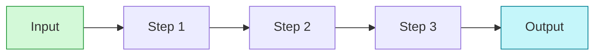

**Variations:**
- Add `-.->` for optional paths
- Add `==>` for critical path
- Use subgraphs to group phases

## 2. Decision Tree

Branching logic with conditions.

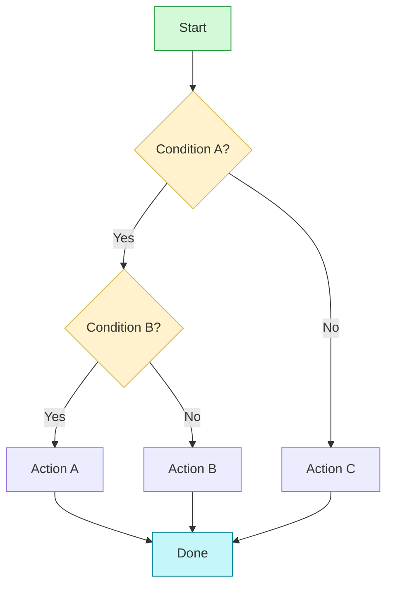

## 3. Architecture (Grouped Components)

System components organized by layer or domain.

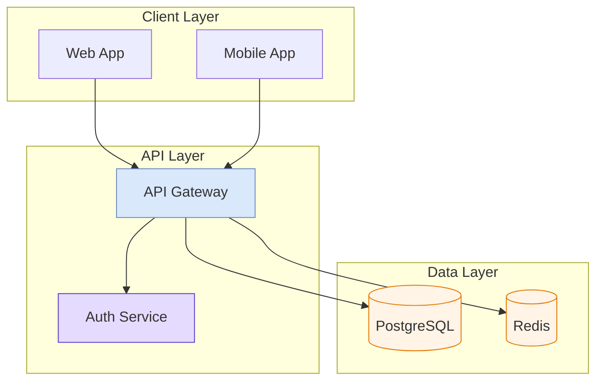

## 4. Sequence Diagram (API Flow)

Interactions between actors over time.

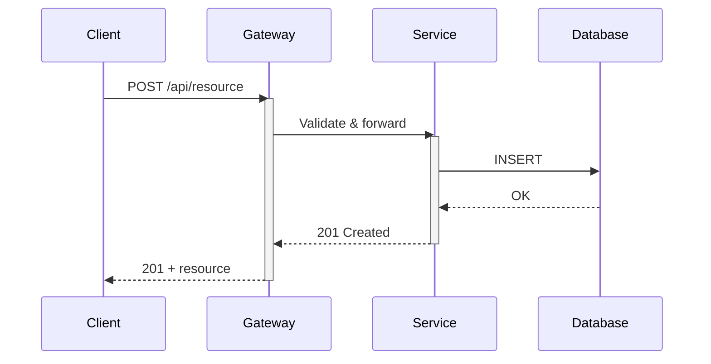

**Tips:**
- Use `activate`/`deactivate` for processing blocks
- `alt`/`else`/`end` for conditional flows
- `loop`/`end` for repeated operations
- `Note over A,B: text` for annotations

## 5. State Machine

States with labeled transitions.

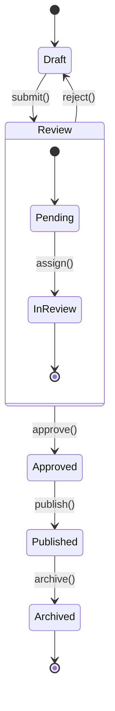

## 6. Class / Domain Model

Objects with attributes and relationships.

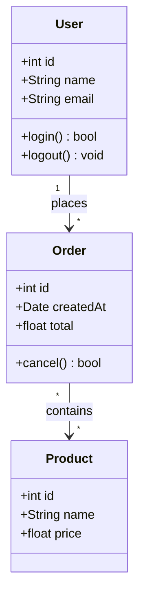

**Relationship types:**
- `-->` association
- `--o` aggregation
- `--*` composition
- `..|>` realization
- `--|>` inheritance

## 7. ER Diagram (Data Model)

Database schema with relationships.

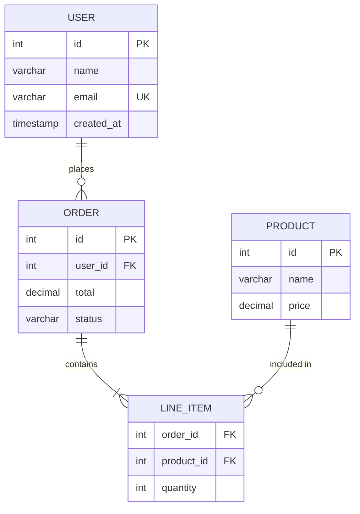

## 8. Mind Map

Hierarchical brainstorm or concept breakdown.

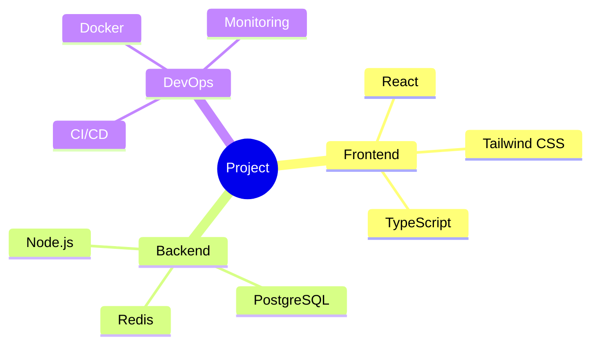

## 9. Gantt Chart (Timeline)

Project schedule with dependencies.

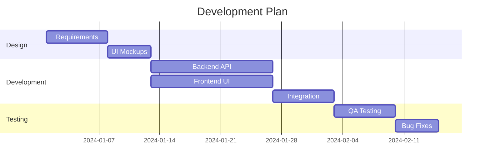

## 10. Feedback Loop

Cyclic process with iteration.

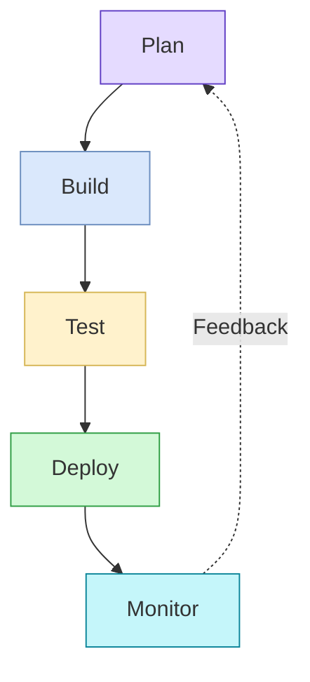

## 11. Comparison (Side by Side)

Contrasting two approaches.

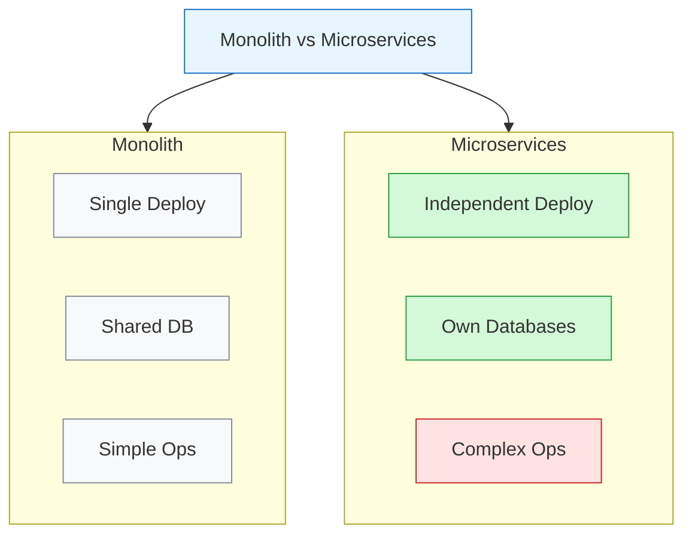

## 12. Hub and Spoke

Central component with surrounding elements.

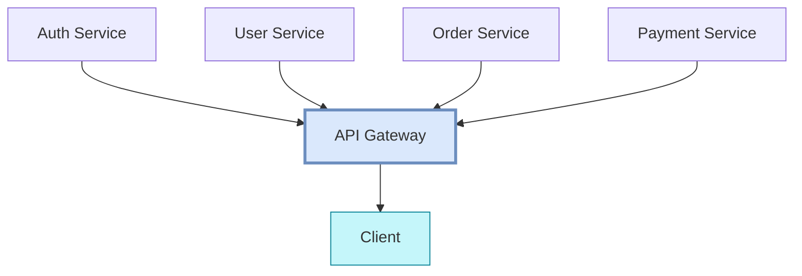

## Rendering Tips

- **Under 10 nodes**: Single diagram, any layout
- **10-30 nodes**: Use subgraphs to organize
- **30+ nodes**: Split into multiple diagrams
- **Dark mode**: Use `--theme tokyo-night --transparent` for versatile SVGs
- **Print**: Use `--theme zinc-light` or `--theme github-light`
- **Presentations**: Use `--theme dracula` for high contrast on projectors
