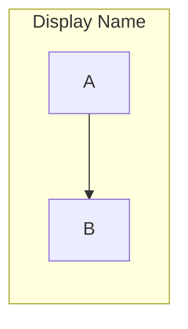
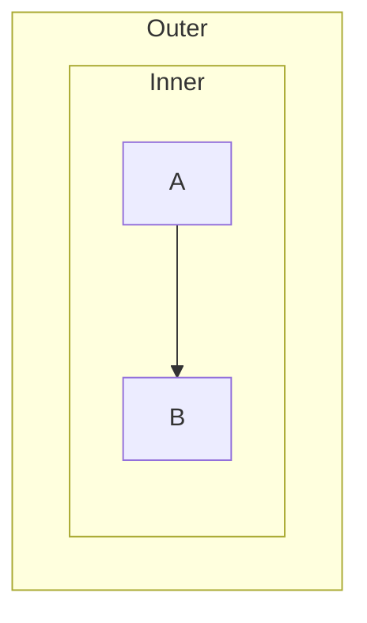
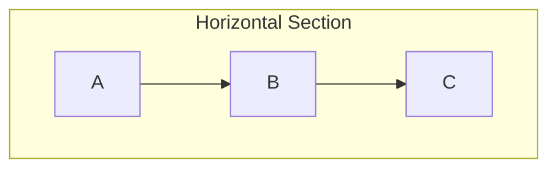
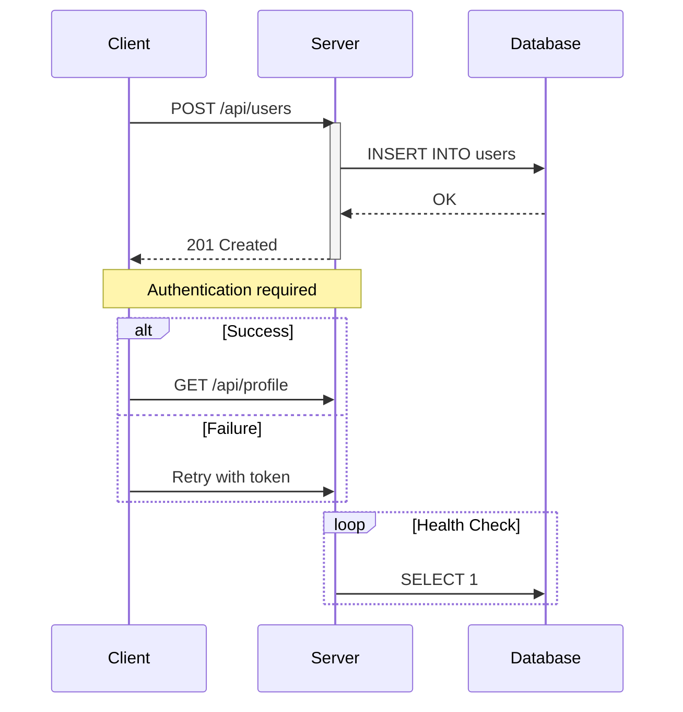
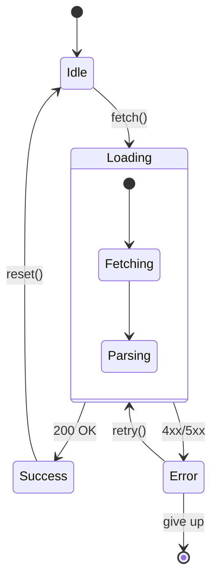
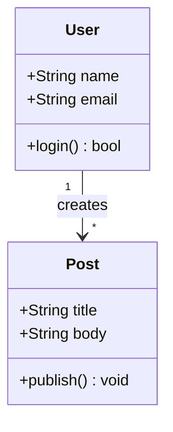
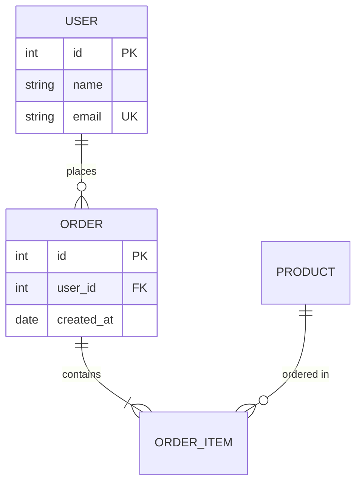
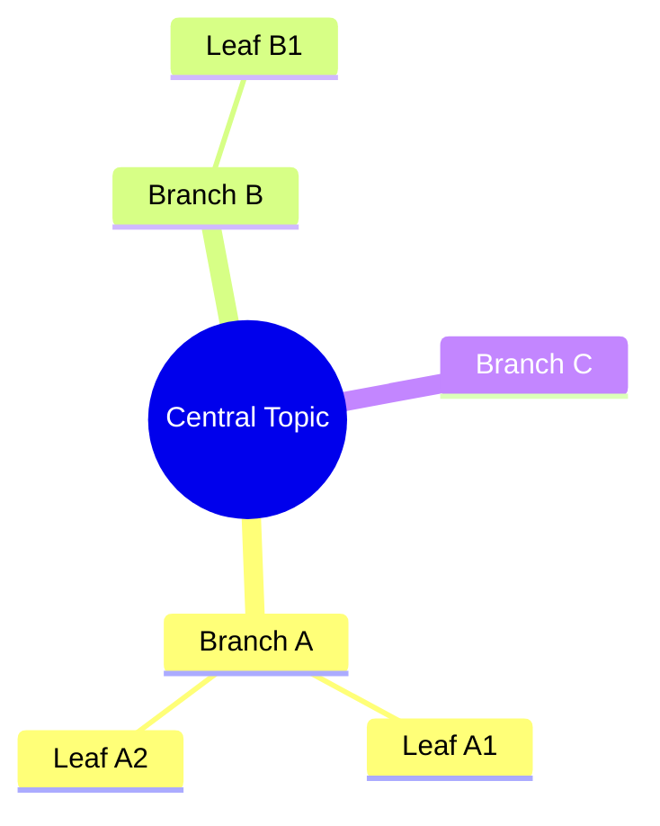
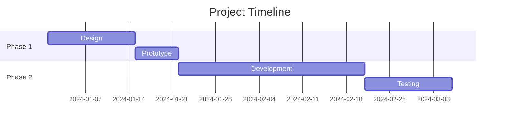

# Mermaid Syntax Reference

Complete syntax reference for Mermaid diagrams. Load this when encountering
syntax errors or needing detailed node/arrow/styling information.

## Critical Error Prevention

### 1. List Syntax Conflict (Most Common)

Mermaid parser treats `number. space` as Markdown ordered list → parse error.

```
WRONG: [1. Perception]
RIGHT: [1.Perception]          Remove space after period
RIGHT: [(1) Perception]        Parenthesized number
RIGHT: [Step 1: Perception]    Prefix word
RIGHT: [Perception]            Drop numbering
```

Circled numbers for safe numbering: ① ② ③ ④ ⑤ ⑥ ⑦ ⑧ ⑨ ⑩ ⑪ ⑫ ⑬ ⑭ ⑮

### 2. Subgraph Naming

Spaces in subgraph names require ID + display name format.

```
WRONG: subgraph Core Process
RIGHT: subgraph core["Core Process"]
RIGHT: subgraph core_process
```

Referencing subgraphs:
```
WRONG: Title --> Core Process
RIGHT: Title --> core
```

### 3. Node References

Always reference by ID, never by display text.

```mermaid
A["Display Text A"]
B["Display Text B"]
A --> B              ✅ Use IDs
```

### 4. Special Characters

```
Spaces:       ["Text with spaces"]
Quotes:       use 『』 instead of "
Parentheses:  use 「」 instead of ()
Line breaks:  <br/> only in circle nodes ((Text<br/>Line 2))
```

Keep node text under 50 characters. Use annotation nodes for longer content.

## Node Types

```mermaid
A[Rectangle]              Default
B(Rounded)                Rounded corners
C([Stadium])              Pill shape
D((Circle))               Circle
E>Right Arrow]            Flag
F{Diamond}                Decision
G{{Hexagon}}              Hexagon
H[/Parallelogram/]        Input/output
I[(Database)]             Cylinder
J[/Trapezoid\]            Trapezoid
```

## Arrow Types

### Basic
```
A --> B          Solid arrow
A -.-> B         Dashed arrow
A ==> B          Thick arrow
A ~~~ B          Invisible link (layout only)
```

### With Labels
```
A -->|Label| B
A -.->|Optional| B
A ==>|Critical| B
```

### Multi-target
```
A --> B & C & D          One to many
A & B & C --> D          Many to one
A --> B --> C --> D       Chaining
```

### Bidirectional
```
A <--> B                 Solid bidirectional
A <-.-> B                Dashed bidirectional
```

## Subgraph Syntax

### Basic


### Nested (max 2 levels)


### Connecting Subgraphs
```mermaid
graph TB
    subgraph g1["Group 1"]
        A[Node A]
    end
    subgraph g2["Group 2"]
        B[Node B]
    end
    A --> B           Connect via nodes (recommended)
    g1 -.-> g2        Connect subgraph IDs (for layout)
```

### Direction Inside Subgraphs


## Layout Directions

```
graph TB    Top to Bottom (default)
graph BT    Bottom to Top
graph LR    Left to Right
graph RL    Right to Left
graph TD    Top Down (alias for TB)
```

**Guidelines:**
- TB/TD: Sequential processes, hierarchies, decision trees
- LR: Timelines, pipelines, wide comparisons
- Mixed: Set `direction` inside individual subgraphs

## Styling

### Inline Style
```mermaid
style NodeID fill:#color,stroke:#color,stroke-width:2px
```

### Multiple Nodes
```mermaid
style A,B,C fill:#d3f9d8,stroke:#2f9e44,stroke-width:2px
```

### Class Definitions
```mermaid
classDef green fill:#d3f9d8,stroke:#2f9e44,stroke-width:2px
classDef blue fill:#dae8fc,stroke:#6c8ebf,stroke-width:2px

class A,B green
class C,D blue
```

### Semantic Color Reference

| Role | Fill | Stroke |
|------|------|--------|
| Input / Start | `#d3f9d8` | `#2f9e44` |
| Process / Action | `#dae8fc` | `#6c8ebf` |
| Decision | `#fff2cc` | `#d6b656` |
| Output / Result | `#c5f6fa` | `#0c8599` |
| Warning / Error | `#ffe3e3` | `#c92a2a` |
| Storage / Data | `#fff4e6` | `#e67700` |
| Reasoning / AI | `#e5dbff` | `#5f3dc4` |
| Neutral | `#f8f9fa` | `#868e96` |
| Title / Header | `#e7f5ff` | `#1971c2` |

### Link/Edge Styling
```mermaid
linkStyle 0 stroke:#2f9e44,stroke-width:2px
linkStyle default stroke:#868e96,stroke-width:1px
```

## Sequence Diagram Syntax



**Arrow types:**
- `->>` solid with arrowhead
- `-->>` dashed with arrowhead
- `-x` solid with cross
- `--x` dashed with cross

## State Diagram Syntax



## Class Diagram Syntax



## ER Diagram Syntax



**Cardinality:**
- `||` exactly one
- `o|` zero or one
- `}|` one or more
- `}o` zero or more

## Mindmap Syntax



## Gantt Chart Syntax



## Troubleshooting

### "Parse error: Unsupported markdown: list"
→ Remove space after `number.` in node text

### "Parse error: Expecting 'SEMI', 'NEWLINE', 'EOF'"
→ Subgraph name has spaces without ID format, or node reference uses display text

### "Parse error: unexpected character"
→ Unescaped special characters in node text

### Diagram renders but looks wrong
→ Check direction is set, verify style declarations, ensure IDs match

### Platform differences
- **GitHub**: Good Mermaid support, renders most modern syntax
- **Obsidian**: Older parser, stricter. Test before finalizing.
- **mermaid.live**: Latest parser. Best for testing.

## Validation Checklist

- [ ] No `number. space` patterns in any node text
- [ ] All subgraphs with spaces use `id["Display Name"]`
- [ ] All references use IDs not display text
- [ ] All arrows use valid syntax
- [ ] Style declarations use valid color format
- [ ] Direction explicitly set
- [ ] All referenced node IDs are defined
- [ ] No emoji in node text
- [ ] Under 30 nodes per diagram
